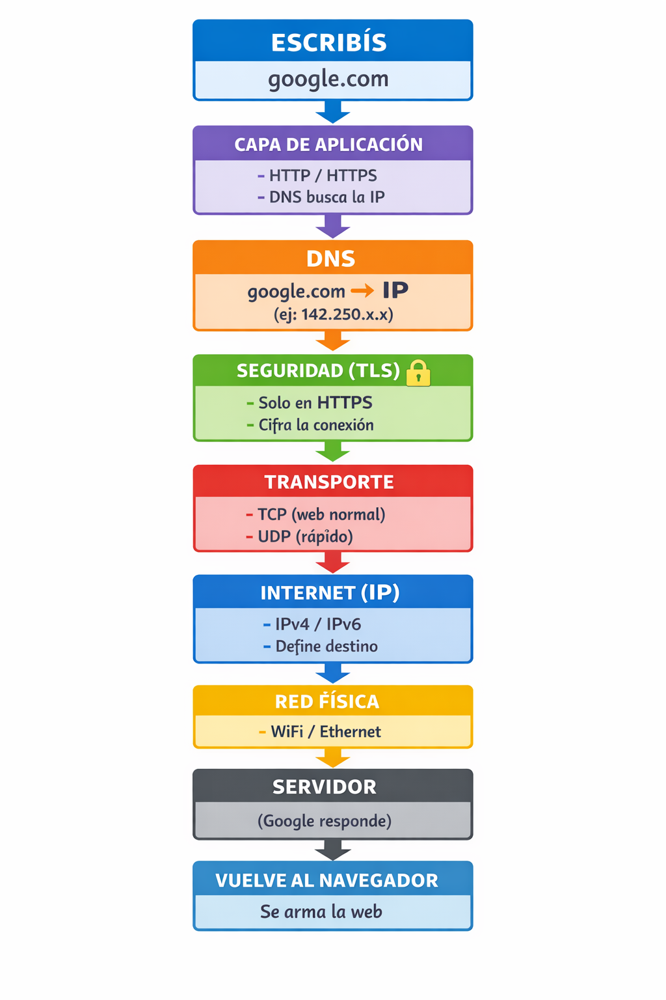

# 🌐 ¿Cómo funciona Internet?

Internet es una red global que conecta dispositivos de todo el mundo mediante un protocolo (lenguaje común). Cada nodo, ya sea una PC, móvil o servidor, tiene una dirección IP única para ser localizado. Hacemos todo este despliegue por una sola razón: intercambiar información, desde ese meme que te hizo reír, hasta las fotos de tus vacaciones o un mensaje importante. Cuando usas una Web, el DNS traduce el nombre a una IP para encontrarla; en una App, esta ya sabe a qué servidor llamar (vía API); y entre PCs, se hablan directamente de igual a igual. Para que este intercambio sea veloz y seguro, los datos se fragmentan en paquetes pequeños, viajan protegidos por capas de seguridad y, al llegar a su destino, se reensamblan para mostrarte el contenido completo en tiempo real.

## Proceso de navegación: (Modelo TCP/IP)

## Capas de la aplicacion: (Application Layers)

Esta capa es la interfaz que usas. Aquí es donde se originan las peticiones para intercambiar esos memes y fotos.

HTTP (HyperText Transfer Protocol): protocolo para transferir páginas web entre tu navegador y un servidor.  
HTTPS (HTTP Secure): lo mismo que HTTP, pero cifrado para que nadie pueda espiar los datos.  
DNS (Domain Name System): traduce nombres de sitios (como google.com) en direcciones IP que es la ubicación del servidor en internet, èsta IP puede cambiar.  

* 💡 Idea clave:  
  * 👉 “Cuando escribimos un dominio como google.com, el DNS lo traduce a una dirección IP que indica dónde está el servidor en internet.”  
  * 👉 “El dominio es el nombre fácil, y la IP es la dirección real del servidor al que se conecta la web.”

## Capas de transporte: (Transport Layers)

Se encarga de cómo viajan los paquetes, asegurando que lleguen a la "puerta" (puerto) correcta de la aplicación.

TCP (Transmission Control Protocol): envía datos de forma segura, ordenada y verifica que todo llegue bien (es como un envío certificado).
UDP (User Datagram Protocol): envía datos rápido pero sin verificar, ideal para streaming o juegos (es como un envío rápido sin rastreo, si se pierde algo, no importa).  
TLS (Transport Layer Security): tecnología que cifra la comunicación sobre la capa de transporte (es lo que hace seguro a HTTPS). Nota: Técnicamente, TLS opera entre la capa de transporte y la de aplicación.  

## Capas de Internet: (Inernet layers)

Define la dirección y la ruta de los paquetes por la red.  

* IP (Internet Protocol): dirección única que identifica un dispositivo en una red (como el “domicilio” en internet).  
  * IPv4: formato clásico (ej: 192.168.1.1). Se quedó sin direcciones por el crecimiento de internet.  
  * IPv6: más moderno y con muchas más direcciones disponibles. Se creó para solucionar la escasez de IPv4.  

## Capas de conexion a Red: (Network access layers)

Define cómo los datos se transmiten físicamente por el cable o el aire.

* Ethernet: conexión física a internet por cable.  
* Wireless: conexión física a internet sin cables (ej: WiFi, datos móviles).  

---

## Gráfico de Fujo de conexion

