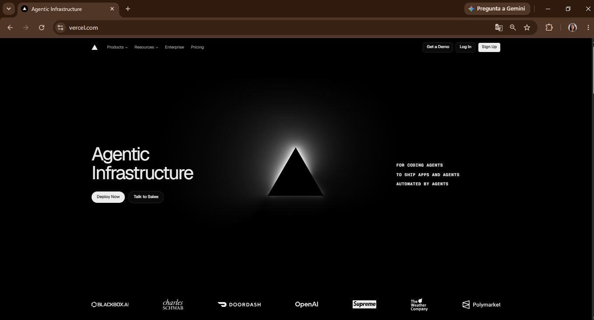
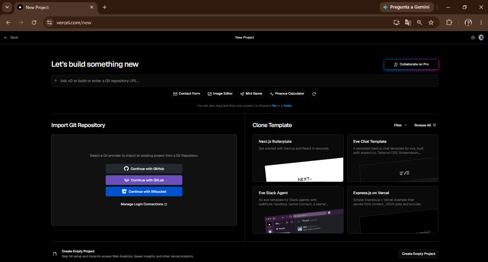

# Entrega final del proyecto

## Curso Node JS - Talento Tech 2026 (Comisión 26132)

Entrega final, en el ejercicio 14 de éste Repo, encontrarán información detallada de como hacer la entrega del proyecto final, alli encontrarán información detallada de todo lo que se necesita para poder entregarlo, con explicaciones fáciles y simples, espero les sea de utilidad, aquí solo veremos el deploy a Vercel de ese proyecto final, !mucha suerte con sus entregas!

DEPLOY Vercel

* Antes de subir su repo a vercel agreguen un archivo en su raiz de su app, con el nombre de vercel.json, a continuacion les dejo lo que va en ése archivo:

  ```Json
  {
    "version": 2,
    "builds": [
      {
        "src": "index.js",
        "use": "@vercel/node"
      }
    ],
    "routes": [
      {
        "src": "/(.*)",
        "dest": "index.js"
      }
    ]
  }
  ```

* Ingresan a la página de [Vercel](https://vercel.com/)  
  
* Si no tienen cuenta pueden ingresar con **SingUp** si crean una cuenta nueva, sino **LogIn**  

* les va a pedir un nombre de Team, y luego ingresan al dashboard alli deberan elegir, Import Git Repository, les pedira Login, si no ingresaron con github, les pedira confirmacion deberan poner install, luego de loguearse les mostrará la lista de repositorios, elijan en donde tienen su proyecto final, y presionen import, denle ok a los siguientes popup, y listo el despliegue esta listo..
espero les haya servido y buena suerte con el despliegue de sus proyectos.
