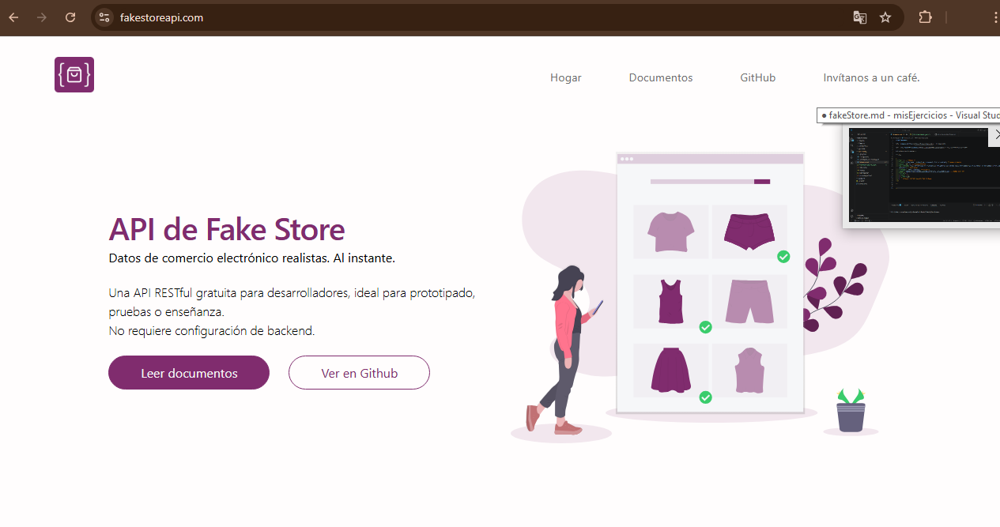
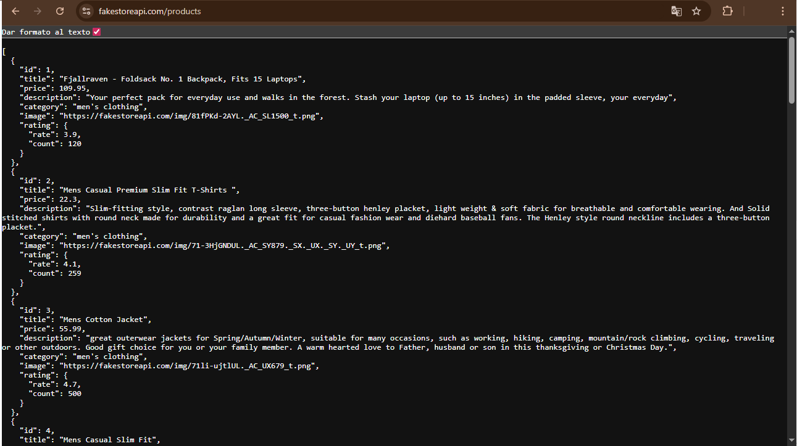

# Api Fakestore

## URL:  [Pagina FakeStore](https://fakestoreapi.com/) - Documentación  

  

## API:  [API FakeStore Productos](https://fakestoreapi.com/products) - API, 20 Productos de Prueba  

  

## Estructura base Productos

```Json

{
    "id": 1, // Product id
    "title": "Fjallraven - Foldsack No. 1 Backpack, Fits 15 Laptops", // nombre producto
    "price": 109.95,  // Precio producto
    "description": "Your perfect pack for everyday use and walks in the forest. Stash your laptop (up to 15 inches) in the padded sleeve, your everyday", // descripcion
    "category": "men's clothing", //categoria
    "image": "https://fakestoreapi.com/img/81fPKd-2AYL._AC_SL1500_t.png", // imagen tipo url
    "rating": {
      "rate": 3.9,
      "count": 120
    } // rating y cantidad vendida tipo contador
  },

```

1. GET: Obtener datos  
    El método GET se usa para recuperar información. Puedes traer todos los productos o uno solo especificando su ID en la URL.

    **Obtener todos los productos**

    ```JavaScript
    fetch('https://fakestoreapi.com/products')
    .then(response => response.json())
    .then(data => console.log(data));
    ```

    *Respuestas*  
    201 Producto creado con éxito  
    400 Solicitud incorrecta  

    **Obtén un solo producto**  
    Recuperar detalles de un producto específico por ID.

    **Parámetros de ruta**  

    |    Campo    | Tipo          |
    | ----------- | ------------- |
    | id          | integer       |  

    *Respuestas*  
    201 Producto creado con éxito  
    400 Solicitud incorrecta  

    ```Javascript
    fetch('https://fakestoreapi.com/products/1')
    .then(response => response.json())
    .then(data => console.log(data));
    ```

2. POST: Crear un nuevo recurso  
    Para enviar datos a la API, usamos el método POST. Es importante convertir el objeto de JavaScript a un string JSON y definir los headers.

    Esquema del cuerpo de la solicitud: application/json  
    requerido  

    |    Campo    | Tipo          |
    | ----------- | ------------- |
    | id          | integer       |
    | title       | string        |
    | price       | number float  |
    | description | string        |
    | category    | string        |
    | image       | string        |  

    *Respuestas*  
    201 Producto creado con éxito  
    400 Solicitud incorrecta  

    ```JavaScript
    const product = { title: 'New Product', price: 29.99 };
    fetch('https://fakestoreapi.com/products', {
      method: 'POST',
      headers: { 'Content-Type': 'application/json' },
      body: JSON.stringify(product)
    })
      .then(response => response.json())
      .then(data => console.log(data));
    ```

3. PUT / PATCH: Actualizar datos  
    Para modificar un recurso existente, se concatena el ID del producto en la URL.

    PUT: Reemplaza el recurso completo.

    PATCH: Actualiza solo los campos enviados.

    **Parámetros de ruta**  

    |    Campo    | Tipo          |
    | ----------- | ------------- |
    | id          | integer       |  

    Esquema del cuerpo de la solicitud: application/json  
    requerido  

    |    Campo    | Tipo          |
    | ----------- | ------------- |
    | id          | integer       |
    | title       | string        |
    | price       | number float  |
    | description | string        |
    | category    | string        |
    | image       | string        |  

    *Respuestas*  
    201 Producto creado con éxito  
    400 Solicitud incorrecta  

    ```JavaScript
    const product = { title: 'Updated Product', price: 39.99 };
    fetch('https://fakestoreapi.com/products/1', {
      method: 'PUT',
      headers: { 'Content-Type': 'application/json' },
      body: JSON.stringify(product)
    })
      .then(response => response.json())
      .then(data => console.log(data));
    ```

4. DELETE: Eliminar un recurso  
    Este método simplemente requiere el ID del recurso que deseas borrar.  

    **Parámetros de ruta**  

    |    Campo    | Tipo          |
    | ----------- | ------------- |
    | id          | integer       |  

    *Respuestas*  
    201 Producto creado con éxito  
    400 Solicitud incorrecta  

    ```JavaScript
      fetch('https://fakestoreapi.com/products/1', {
      method: 'DELETE'
    })
      .then(response => response.json())
      .then(data => console.log(data));
    ```

## Notas importantes

**Persistencia:** FakeStoreAPI es una API de prueba. Esto significa que nada se guarda realmente en su base de datos. Si haces un POST o un DELETE, la API te responderá con éxito y te devolverá los datos, pero si vuelves a consultar la lista general, los cambios no estarán ahí.

**Async/Await:** He utilizado async/await porque hace que el código sea mucho más legible y fácil de documentar que los .then() anidados.

### TODA LA INFORMACIÓN DE ÉSTE DOCUMENTO ESTÁ BASADA EN [DOCUMENTACION DE FAKESTORE](https://fakestoreapi.com/docs#tag/Products)
